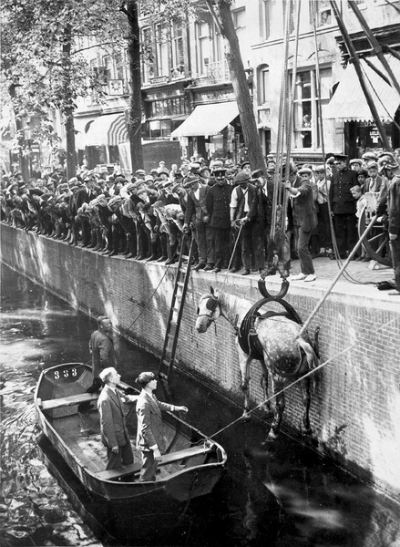

# The Horse Crane

*The story was not written down anywhere as one piece. It is scattered across a city archive
record, a museum's blog, a heritage society's article and the evening edition of a 1929
newspaper. Here it is in one place, with the picture.*

*Leliegracht, July 1929. Stadsarchief Amsterdam, Vereenigde Fotobureaux N.V. Public domain.
Metadata in the [sidecar](1929-07-leliegracht-toestel-van-sinck.yml).*

## What happened on this spot

A carter working for the firm Vogelpoel en Noorwegen left his wagon standing on the Westermarkt.
The horse took fright at something and went into the water, wagon and all. It kicked itself free
of the harness and swam — down the Herengracht, until it found footing under the bridge where
the Leliegracht crosses.

That is where they got it out, with a machine that a horse butcher had invented seventy years
earlier and three blocks away. The photographer arrived in time to catch the crowd, which was
the usual crowd. When the horse crane came out, so did everybody.

The picture ran in the evening edition of the *Algemeen Handelsblad* on 16 July 1929. The
morning edition had already carried the accident as a paragraph of city news.

## The machine, and the man who needed one

In 1852 a tanner named Gerrit Sinck set up a business called Het Zwarte Paard — The Black Horse
— out on the Schans by the Raampoort, at what was then the edge of town. When the Marnixstraat
was cut through in 1866 his address became Marnixstraat 194, and he took his son Johan Christoph
Sinck (1837–1923) into partnership as G. Sinck en Zoon, tannery and horse butchery.

It was the first horse butchery in Amsterdam, and it was a complete industry on one plot:
stables, horses for hire, horse dealing, the slaughterhouse, the tannery, and a shop out front
selling the meat. He paid a hundred guilders for *"vette, gezonde, voor den dienst onbruikbare
paarden"* — fat, healthy horses no longer fit for service. If you sold him your horse you could
take a hoof home afterwards as a keepsake.

From about 1860 the Jordaan ate it. Beef was climbing out of reach and a cut of horse cost
twelve cents a kilo, which was the difference between dinner and an empty dish.

Late in the century the city ran on roughly four thousand working horses — carts, wagons,
coaches, the horse trams. Heineken kept its own. There were dozens of stables renting them out.
And with four thousand horses working alongside a hundred kilometres of unfenced canal, horses
went into the water constantly.

The first method was a rope thrown over the branches of a canalside tree. It worked, slowly, and
it injured the horse about as often as it saved it. After a failed rescue in 1860 — a horse-drawn
omnibus in the water — Johan built something better: a wheeled tripod with a tackle, that could
be brought to the accident and set up over it.

It became famous as *het toestel van Sinck*, which Amsterdammers promptly corrupted to
*zinktoestel*. Around fifty horses a year came out of the canals on it. He charged between ten
and forty guilders a lift, and the Heeren Sinck were telegraphed for whenever anything went in —
later including motorcars. In 1911 the device pulled an Atax taxi out of the Singel at the Spui.

## The part that makes it a recycling centre

He never stopped being the butcher. A horse that came up hurt beyond saving was bought from its
owner on the spot, killed there, and carried back to the Marnixstraat, and it was on the counter
in his shop the same day. Some of it went on to the lions at Artis.

So the yard took in a horse by any route — sold at market, drowned in a canal, worn out in
harness — and sent it back out as meat, as leather from the tannery, and as a hoof in its former
owner's hands. Don's name for the place is exact. It was a recycling centre for horses, at
municipal scale, and its most famous product was a rescue service.

## Afterwards

Johan's sons sold the hoist to the city in 1917. The Stadsreiniging had one too, and in 1918 the
whole job passed to the fire brigade, who kept using it into the 1930s — which is why the men in
this photograph are firemen, and why the machine in it outlived the man who built it by six
years.

There is a working model of it in the Amsterdam Museum, at 15:100 scale, where you can hoist
your own horse out of your own canal. Recommended, particularly for children, who understand
immediately what the machine is for.

## Now

Marnixstraat 194 is a coffeeshop called 1e Hulp — *First Aid* — which is either a coincidence or
the best joke in the neighbourhood, given that its address spent seventy years as the place you
called when something needed pulling out of a canal.

Don stopped in and told them what their address used to be. They thought it was cool.

The big horse doors into the warehouse next door are still there.

## Sources

- Stadsarchief Amsterdam, *Paard te water* — the incident, and the photograph:
  [record](https://archief.amsterdam/beeldbank/detail/875cdbf3-7446-3044-ea31-e0232fb759be)
  (image OSIM00002000423, auteursrechtvrij)
- Amsterdam Museum / hart.amsterdam, *#020today: Paardenvlees* — Het Zwarte Paard, the crowds,
  the scale model
- Hippomobiel Erfgoed, *Sinck slacht, redt, bouwt* — the business, and the line that started
  this: Marnixstraat 194, *"nu het adres van een coffeeshop"*
- *Ons Amsterdam*, 11 December 1924 — the Heeren Sinck, the telegraph, and Artis
- *Algemeen Handelsblad*, 16 July 1929, evening edition — where the photograph first ran

Nothing here is our own observation except the last three lines, which are
[Don's](../../sources.yml). Everything else is other people's research, cited so it can be
checked and so the credit stays where it belongs.
